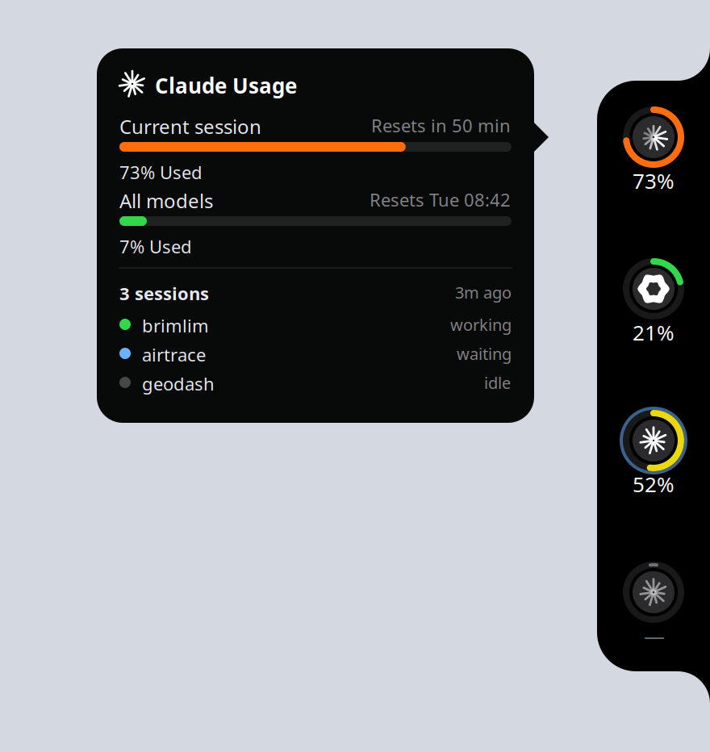
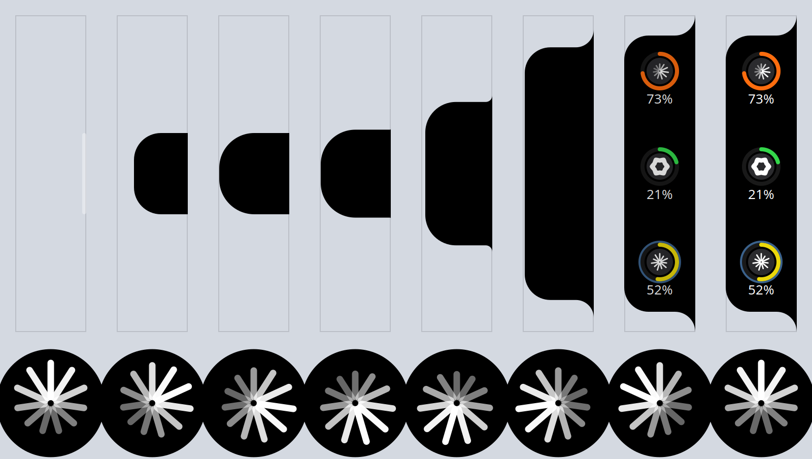

<div align="center">


# brimlim

**How much of your AI coding assistants' limits you have burned — and whether
an agent is working right now — on a notch at the edge of your Linux screen.**

[](https://github.com/the-wagner-dev/brimlim/actions/workflows/ci.yml)
[](LICENSE)
[](#install)



</div>

---

brimlim sits collapsed against a screen edge as a 4-pixel tongue. Hover it and
a black pill grows out with one ring per assistant: the arc is the most
constraining usage window, the mark says which assistant, the number under it
is the percentage. Click a ring for the full card — every window, when each
resets, and which of your sessions are working, waiting or idle.

It is three pieces that do not share a process: a Rust daemon with no GUI, a
GNOME Shell extension, and a GTK4 layer-shell frontend for Hyprland, KWin and
sway. The daemon publishes state on the session bus; either frontend reads it.
Kill the daemon and your Shell keeps running.

**The rule the whole thing is built around: a frontend never shows an invented
percentage.** Every failure degrades into a visible status instead of a number.
See [Honesty](#honesty).

## Install

### Ubuntu / Debian — apt

```bash
curl -fsSL https://the-wagner-dev.github.io/brimlim/brimlim-archive-keyring.gpg | sudo tee /etc/apt/keyrings/brimlim-archive-keyring.gpg > /dev/null
echo "deb [signed-by=/etc/apt/keyrings/brimlim-archive-keyring.gpg] https://the-wagner-dev.github.io/brimlim stable main" | sudo tee /etc/apt/sources.list.d/brimlim.list
sudo apt update && sudo apt install brimlim
```

Then start the daemon and pick a frontend:

```bash
systemctl --user enable --now brimlimd.service
gnome-extensions enable brimlim@the-wagner-dev.github.io   # GNOME
brimlim-gtk --edge right                                   # Hyprland / KWin / sway
```

On GNOME you may need to log out and back in once before the extension appears
— the Shell scans for new extensions at startup.

### A single .deb

Download `brimlim_<version>_amd64.deb` from
[Releases](https://github.com/the-wagner-dev/brimlim/releases) and:

```bash
sudo apt install ./brimlim_0.1.0_amd64.deb
```

### AppImage

Two separate images, on purpose. `brimlimd` is a plain Rust binary that
bundles to five megabytes and is all you need for a waybar module; the GTK
frontend has to carry GTK4 with it.

```bash
chmod +x brimlimd-x86_64.AppImage && ./brimlimd-x86_64.AppImage
chmod +x brimlim-gtk-x86_64.AppImage && ./brimlim-gtk-x86_64.AppImage --edge right
```

### From source

```bash
sudo apt install build-essential pkg-config libgtk-4-dev libgtk4-layer-shell-dev gjs
cargo build --release

install -Dm755 target/release/brimlimd ~/.local/bin/brimlimd
sed 's|/usr/bin/brimlimd|%h/.local/bin/brimlimd|' packaging/systemd/brimlimd.service \
    > ~/.config/systemd/user/brimlimd.service
systemctl --user enable --now brimlimd.service

cp -r "gnome-extension/brimlim@the-wagner-dev.github.io" ~/.local/share/gnome-shell/extensions/
glib-compile-schemas ~/.local/share/gnome-shell/extensions/brimlim@the-wagner-dev.github.io/schemas/
gnome-extensions enable brimlim@the-wagner-dev.github.io
```

Configuration is optional; see [`config.example.toml`](config.example.toml),
which goes in `~/.config/brimlim/config.toml`.

## What it reads

Both v1 providers are `official` — they report numbers the vendor produced, or
no number at all. Nothing is estimated from token counts.

| | source | how |
|---|---|---|
| **Claude** | `api.anthropic.com/api/oauth/usage` | the OAuth token Claude Code already refreshed into `~/.claude/.credentials.json`, asked at most once every five minutes. Sessions from `~/.claude/sessions/<pid>.json`. |
| **Codex** | `~/.codex/sessions/**` | Codex writes the server's own `rate_limits` payload into every rollout log, so there is no second API call at all. Sessions from `/proc`. |

brimlim never refreshes anyone's OAuth token — that would race the CLI for the
same file. An expired token is reported as `needs_auth`, and you fix it by
using the CLI as usual.

More providers go behind the same `UsageProvider` trait; see
[`crates/brimlimd/src/providers`](crates/brimlimd/src/providers).

### Activity

There is no portable "is the assistant thinking" API, so two honest signals
are combined per session: the process is burning CPU, and its log grew
recently.

| | |
|---|---|
| `working` | burning ≥ 0.12 of a core, or wrote to its log in the last 6s |
| `waiting` | alive and used within 30 min, but not computing |
| `idle` | anything else |

Neither signal ever becomes a usage percentage.

## Honesty

A usage overlay that guesses is worse than no overlay, because you will act on
the guess. So every failure mode has a visible shape:

* a provider that fails but has a remembered reading → the real old number,
  with a non-`ok` status and its age shown;
* a provider that fails with nothing remembered → no number at all;
* a reading older than `stale_after_minutes` → `stale`, drawn dimmed;
* a window past its `resets_at` → dropped entirely, because its percentage now
  describes a period that no longer exists. If that empties a provider, the
  number goes with it.
* a reading the vendor did not produce → drawn with a dashed arc, so
  `official` and `derived` never look alike.

Readings survive restarts in `~/.local/state/brimlim/readings.json`. Sessions
and activity are not persisted, because they would be lies the moment they
were written down.

Rate limiting is staleness, not an error: the last reading stays on screen
while the provider backs off, honouring `Retry-After` and otherwise doubling
from two minutes up to twenty.

## Using it from anything else

The daemon is the product; the notch is one view of it.

```bash
brimlimd --json      # one snapshot on stdout, then exit
```

`--json` asks a running daemon first and only polls directly if nobody is
serving the bus name — the daemon has warm caches and CPU history, so its
answer is better than anything a short-lived process can produce. Force the
direct path with `--no-daemon`.

### waybar

```json
"custom/brimlim": {
  "exec": "brimlimd --json",
  "return-type": "json",
  "interval": 5
}
```

waybar wants `text`/`tooltip` keys, so pipe through `jq` to shape it.

### D-Bus (session bus)

| | |
|---|---|
| Name | `org.brimlim.Daemon` |
| Path | `/org/brimlim/Daemon` |
| `GetState() -> s` | the whole state as JSON |
| `Refresh(provider_id: s)` | poll for real now; empty id means all |
| `StateChanged(s)` | emitted only when the content actually changed |

State crosses the bus as a JSON string rather than a D-Bus struct, so adding a
field never breaks a running frontend.

```json
{
  "schema": 1,
  "generated_at": "2026-09-20T17:30:04Z",
  "providers": [{
    "id": "claude",
    "label": "Claude",
    "headline_percent": 0.62,
    "windows": [
      {"name": "Session", "percent": 0.62, "resets_at": "2026-09-20T18:00:00Z"},
      {"name": "Weekly",  "percent": 0.31, "resets_at": "2026-09-24T00:00:00Z"}
    ],
    "fidelity": "official",
    "status": "ok",
    "activity": "busy",
    "sessions": [{"name": "repo-x", "pid": 12345, "state": "working"}],
    "updated_at": "2026-09-20T17:29:56Z",
    "message": null
  }]
}
```

* `status`: `ok | stale | needs_auth | error`
* `activity`: `idle | busy | waiting`
* `fidelity`: `official | derived | manual`
* `headline_percent` is the most constraining window, and is `null` whenever
  there is nothing real to show.

## Behaviour

At rest the notch is a 4×80 logical-pixel tongue. Hover it and the notch does
not slide out — it grows out. A drop swells from the edge, stretches along it
into the pill, and only then do the marks appear on it; the tongue fades as
the drop takes over, because once the pill is out there is nothing left for
the tongue to say.



That whole animation is one pure function of a 0..1 progress value, written
once per port and checked frame for frame against the other, so the two
frontends move identically. Leaving collapses it after a 400 ms grace period,
so clipping the corner of the pill on the way somewhere else does not dismiss
it. Clicking the body pins it open; clicking a ring refreshes that provider
and stops there.

While an agent is working, its mark animates: a wave of light runs round the
spokes of the Claude burst, and the Codex rosette breathes. There is no
separate spinner — the thing that moves is the thing that says which
assistant is busy.

When a session stops working, or starts waiting on you, the notch comes out
by itself for five seconds and the waiting session's ring gets a **blue**
pulse around it. Blue, and never orange or red: colour in this product means
one thing only, how close you are to a limit, so "this one wants you" has to
sit off that grade entirely. The first state after startup announces nothing,
so logging in does not chime once per open session, and both halves have
their own switch — turn off `reveal-on-activity` and the notch will only ever
appear when you hover it.

`auto-hide` (the default), `always-visible` and `hidden` are the three modes.
Edge, monitor, whether to stay up in fullscreen and in the overview, and
whether to chime when an agent finishes are all settings.

## Two frontends, and why

GNOME does not implement `wlr-layer-shell` and has said it will not. So there
are two:

* **GNOME Shell extension** (GJS, GNOME 50) — a floating actor added with
  `Main.layoutManager.addChrome()`, no panel indicator.
* **`brimlim-gtk`** (Rust, GTK4 + gtk4-layer-shell) — for Hyprland, KWin,
  sway. Run it on GNOME and it says so and exits 1, rather than dying inside
  GDK. It gets two things GNOME 50 no longer can do: a real input region, so
  the collapsed notch genuinely hands its pixels back, and two separate
  surfaces, so the card is not constrained by the notch's geometry.

The drawing logic is therefore written twice, in GJS/Cairo and Rust/Cairo.
That is a transliteration rather than a second implementation — and CI checks
the two ports still agree on 101 points of the colour grade, 16 edge/count
combinations of geometry and 168 frames of the reveal, so the transliteration
cannot rot silently.

## Development

```bash
cargo test                                   # providers on recorded fixtures, engine, CLI
gjs -m tools/test.js                         # announce policy, HiDPI geometry, formatting, palette
gjs -m tools/render-preview.js out.png 2     # the GJS drawing, four edges, no Shell needed
gjs -m tools/render-reveal.js out.png 2      # the reveal and the mark's animation, frame by frame
cargo run -p brimlim-gtk --example render -- out.png 2
cargo run -p brimlim-gtk --example reveal -- out.png 2
tools/nested-shell.sh                        # load the working tree into a throwaway GNOME Shell
```

[`docs/design.md`](docs/design.md) is the long version: what GNOME 50 changed
about input regions and what replaced it, how the nested-Shell harness catches
"it enabled but drew nothing", why the provider marks are drawn rather than
typed, and the AppImage trap that breaks every layer-shell program.

Packaging:

```bash
./packaging/deb/build.sh              # dist/brimlim_<version>_amd64.deb
./packaging/gnome-extension/build.sh  # the zip extensions.gnome.org accepts
./packaging/appimage/fetch-tools.sh && ./packaging/appimage/build.sh
```

Tagging `v<version>` builds all of it in CI, attaches it to a GitHub release
and publishes the apt repository. There is no auto-updater; packages are the
update mechanism.

## Status

v0.1.0. The daemon, both frontends and the packaging are built and tested.
The GTK frontend has not yet been run on a real layer-shell compositor —
if you use Hyprland, KWin or sway,
[a report is worth a lot](https://github.com/the-wagner-dev/brimlim/issues).

Contributions welcome; see [CONTRIBUTING.md](CONTRIBUTING.md).

## Credits

The idea of an edge-of-screen notch for assistant usage comes from
[codenotch](https://github.com/vinzdg/codenotch) (macOS). brimlim is an
independent implementation written from scratch against Linux APIs — no code
or assets were taken from it. See [NOTICE](NOTICE).

Not affiliated with Anthropic or OpenAI.

MIT licensed — see [LICENSE](LICENSE).
